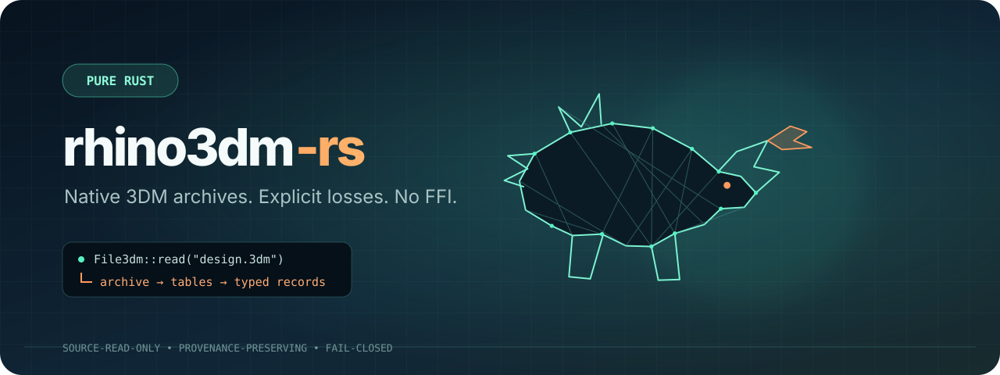

<p align="center">
  
</p>

<p align="center">
  <a href="LICENSE"></a>
</p>

`rhino3dm-rs` is a pure-Rust foundation for inspecting native Rhino `.3dm`
archives and admitting exact engineering STEP-to-Rhino B-rep transfer without
Rhino, OpenNURBS, CPython, WebAssembly, or FFI. It indexes archive structure,
projects recovered semantic data for render planning, and reports losses
explicitly instead of presenting incomplete geometry as a successful decode.

> **Early-stage API:** archive framing and the typed records below are usable;
> complete curve, mesh, Brep, and extrusion APIs are still in progress.

## Python compatibility roadmap

The [Python parity audit and implementation plan](docs/parity/README.md) records
the exact versioned oracle, current gaps, proposed architecture, ordered work
packages and differential acceptance tests. Start a coding agent with the
[handoff brief](docs/parity/AGENT_HANDOFF.md), or read the complete
[offline HTML guide](docs/parity/index.html). These are specifications for
unfinished work, not a claim of 1:1 Python compatibility.

## Why this exists

Most 3DM tooling is backed by OpenNURBS or Rhino. This project explores a
portable Rust-native boundary for servers, robots, build pipelines, and other
systems where deterministic inspection and explicit unsupported-data reporting
matter more than pretending every file was decoded completely.

## Current support

| Capability | Status |
| --- | --- |
| Native 3DM signature and archive version | Implemented and tested |
| Top-level table and direct-record index | Implemented and tested |
| Object UUID, name, layer index, and user strings | Implemented for supported modern attributes |
| Points | Typed decode implemented |
| Instance references and 4×4 transforms | Typed decode implemented |
| v6+ instance definitions and ordered member UUIDs | Typed decode implemented |
| Renderer-facing semantic document (layers, IDs, user strings, blocks, PBR scalar/mapping records) | Implemented with explicit PBR gaps |
| `rhino3dm-render` technical SVG package | Implemented: deterministic point/display-mesh preview with omission reporting |
| Exact STEP → Rhino B-rep/NURBS admission path | Implemented, strict and atomic; no mesh fallback |
| STEP assemblies with Rhino block definition/occurrence export | Not yet supported; intentionally refused |
| Curves, meshes, Breps, and extrusions | Classified; native typed decode incomplete |
| Texture files and embedded image bytes | Asset descriptors/hashes exposed; image bytes are not yet exposed |
| Mesh UV channels and per-triangle texture assignments | Exposed as source-tagged raw channels/assignments; Rhino tag vocabulary remains in progress |
| Geometry census through the Rust `cadmpeg` bridge | Available as an explicit loss report |
| General 3DM writing or mutation | Not supported; exact STEP import is the current narrow write path |

## Python parity feature checklist

This is the repository-level parity map for the pinned Python `rhino3dm`
oracle. A checked item means the bounded Rust surface has an implementation
and a passing regression or oracle-backed observation; an unchecked item is
missing, partial, or still awaiting a conformance case. The exhaustive
overload-aware ledger remains the source of truth: it currently contains
3,229 obligations, so this summary is intentionally grouped by feature family.

### P00 — oracle, inventory, and conformance harness

- [x] Pin the Python distribution/runtime, exported symbols, stubs, and oracle lock.
- [x] Generate an overload-aware operation ledger and declarative comparison cases.
- [x] Run foundation cases with numeric comparison and mismatch rejection.
- [x] Attach stable inventory, stub, and release-source pointers to every ledger obligation.
- [x] Run target-free Rust checks and deterministic ledger regeneration in CI.
- [ ] Add fuzz/property cases and CI closure reporting for the complete ledger.

### P01 — native `.3dm` archive and object framing

- [x] Validate signature/version, checked chunks, tables, object index, and EOF.
- [x] Retain source bytes/spans and verify class-data and nested CRC boundaries.
- [x] Bound source reads and report truncation, malformed records, and instance-definition diagnostics.
- [ ] Complete decompression/resource budgets and explicit recovery-mode semantics.
- [ ] Qualify the full historical archive/version and object-record matrix.

### P02 — value objects and mathematical foundations

- [x] Implement the covered `Point2d/3d/3f/4d`, `Vector3d/3f`, `Line`, `BoundingBox`, `Interval`, and `Transform` behavior.
- [x] Implement the bounded analytic `Plane`, `Circle`, and `Sphere` evaluation slice.
- [x] Implement the bounded analytic `Arc` evaluation, trimming, reversal, and transform slice.
- [x] Implement the bounded analytic `Box` value/evaluation slice.
- [x] Implement the bounded analytic `Cylinder` axis/height/section slice.
- [x] Cover unset sentinels, single-precision narrowing, mutation, predicates, and source units.
- [ ] Complete UUID semantics and the remaining primitive value objects.
- [ ] Complete non-finite, degenerate, intersection, and edge-case parity across all foundations.

### P03 — document, tables, attributes, and basic objects

- [x] Decode structural `File3dm` data, layers, points, names, visibility, basic attributes, and UserStrings.
- [x] Decode instance definitions/references and transforms; expose the semantic `SceneDocument` projection.
- [x] Provide the bounded Rust point writer and explicit metadata diagnostics.
- [x] Project Python-shaped object-attribute defaults, source modes, colors, indices, and group mutation in memory.
- [ ] Implement mutable object/table authoring and complete attributes/string/metadata round trips.
- [ ] Qualify general document mutation against Python readback for all supported object types.

### P04 — meshes and point collections

- [x] Preserve mesh vertices, triangle/quad faces, invalid/duplicate-face behavior, mutation, normals, colors, UVs, and topology slices.
- [x] Recover native imported face arity and write source-less Rust meshes with native quad faces.
- [x] Implement PointCloud points, normal/color/hidden/value channels, Python defaults, item snapshots, indexed setters, presence queries, and clear operations.
- [x] Implement PointCloud indexed insertion/removal, merge, and closest-point lookup for the covered collection contract.
- [x] Decode native PointCloud objects and their optional normal/color/scalar payloads; write source-less multi-point native PointCloud objects.
- [x] Keep display tessellation separate from native mesh-face semantics and report projection mismatches.
- [ ] Preserve source-owned double-precision mesh data through independent compressed/raw decode paths.
- [ ] Complete ngons, material/cache fields, full topology and hide/show behavior, and general imported-mesh writing.
- [ ] Serialize native PointCloud minor-version channels, single-point objects, live collection aliases, and remaining overloads.
- [ ] Implement BrepFace and Extrusion mesh-cache parity.

### P05 — curves

- [x] Project typed line, polyline, and NURBS curve carriers without flattening them into display samples.
- [ ] Implement the complete curve model family, evaluation, mutation, validity, and writing APIs.

### P06 — blocks, instances, and scene graphs

- [x] Decode instance definitions/references and transforms; expose the current `SceneDocument` graph.
- [ ] Resolve occurrences, inheritance, caching, omission diagnostics, and complete Three.js/render graph parity.

### P07 — materials, textures, and render content

- [x] Preserve PBR scalar/mapping records, raw UV channels, and texture-assignment records where exposed by the bridge.
- [ ] Complete materials, texture objects, embedded image bytes, render content, and PBR fixture round trips.

### P08 — writing and round trips

- [x] Write points, source-less meshes, native quad faces, and strict atomic exact STEP imports.
- [ ] Implement general `File3dm` encode/decode, tables, attributes, dirty-graph behavior, and Python round trips.

### P09 — Breps, surfaces, extrusions, and solids

- [ ] Implement typed Brep/surface/extrusion decode, topology, trims, faces, edges, and parameter domains.
- [ ] Implement evaluation, mutation, validity, transforms, mesh caches, and native writing.
- [ ] Add exact Python differential fixtures for analytic and invalid/degenerate solid cases.

### P10 — views, annotations, and technical output

- [x] Provide deterministic technical SVG output and strict STEP admission with explicit omission/loss reporting.
- [ ] Implement annotations, views, display modes, remaining document tables, and complete render-content assignment.
- [ ] Close the parity ledger for view/annotation/table ownership and serialization semantics.

### P11 — SubD, compression, and advanced geometry

- [ ] Implement SubD topology and evaluation parity.
- [ ] Implement Draco/compressed mesh decode with bounded resource accounting.
- [ ] Add advanced geometry closure cases and native round-trip qualification.

### P12 — release qualification and downstream integration

- [ ] Qualify supported APIs across macOS/Linux/Windows and the pinned Rust toolchain.
- [ ] Add deterministic fixture, benchmark, fuzz, and compatibility-release gates.
- [ ] Complete robotics/CAD downstream contracts without weakening typed or fail-closed geometry boundaries.

Unsupported or malformed structures return an error or carry a per-record
diagnostic. Callers that require complete geometry must check the admission
gate rather than relying on object counts alone.

## Install

Install directly from GitHub until the first crates.io release:

```toml
[dependencies]
rhino3dm-rs = { git = "https://github.com/lucas-vitrus/rhino3dm-rs" }
```

## Library example

```rust
use rhino3dm_rs::File3dm;

fn main() -> Result<(), Box<dyn std::error::Error>> {
    let model = File3dm::read("model.3dm")?;

    println!("archive version: {}", model.archive_version());
    println!("objects: {}", model.archive().object_count());
    println!(
        "instance definitions: {}",
        model.archive().instance_definitions.len()
    );

    Ok(())
}
```

## CLI inspection

The included `rhino3dm-index` binary prints a deterministic structural and
typed-decoder summary:

```bash
cargo run --release --bin rhino3dm-index -- model.3dm
```

Example fields include archive version, table counts, object-record framing,
attribute completeness, user strings, geometry classes, points, instance
references, and parse errors.

## Geometry admission

`File3dm::probe_geometry` uses the packaged pure-Rust `cadmpeg` geometry bridge
to produce a census and loss report:

```rust
let probe = rhino3dm_rs::File3dm::probe_geometry("model.3dm")?;
if !probe.complete_object_decode() {
    for warning in &probe.warnings {
        eprintln!("{warning}");
    }
    return Err("incomplete geometry decode".into());
}
```

This is intentionally a gate, not a claim that all geometry has a stable
native `rhino3dm-rs` representation.

The same rule applies to appearance. A renderer must not substitute a gray
material or discard textures silently. See
[`docs/pbr-material-parity.md`](docs/pbr-material-parity.md) for the required
material, texture, UV, and render-reconstruction gate.

## Engineering STEP → Rhino

The `step` module transfers ISO 10303-21 engineering geometry as native
B-rep/NURBS only. It rejects losses in geometry, topology, dimensional units,
or product structure and writes the output atomically:

```rust
use rhino3dm_rs::step::{import_exact_step, ExactStepOptions};

let report = import_exact_step("part.step", "part.3dm", ExactStepOptions::default())?;
println!("{} exact B-rep bodies", report.source_bodies);
# Ok::<(), Box<dyn std::error::Error>>(())
```

There is no mesh fallback. See [`docs/engineering-step.md`](docs/engineering-step.md)
for solid/manifold admission and the current block-assembly boundary.

## Renderer-facing scene model

`scene::SceneDocument` exposes document layers, source UUIDs, names, object
attributes, user strings, legacy/PBR material scalars, texture UVW transforms,
block definitions, instance occurrences, and an exact B-rep/NURBS census. Its
Three.js manifest intentionally preserves Rhino Z-up/document units and keeps
Rhino UUIDs in source metadata rather than replacing Three.js runtime UUIDs.

```rust
let scene = rhino3dm_rs::scene::SceneDocument::read("model.3dm")?;
let manifest = scene.threejs_manifest();
if !manifest.required_capabilities.complete_pbr_reconstruction() {
    // Strict textured-PBR rendering is not yet admissible.
}
# Ok::<(), Box<dyn std::error::Error>>(())
```

## Lightweight backend rendering

The workspace's second package, `rhino3dm-render`, renders source display
meshes and points to deterministic SVG—an immediately usable 2D backend for
an AI design loop. It has no native renderer, browser, GPU, or temporary mesh
conversion dependency. It intentionally does not tessellate B-rep/NURBS: an
exact object with no source display mesh is identified in `omitted_objects`.

```toml
[dependencies]
rhino3dm-rs = { git = "https://github.com/lucas-vitrus/rhino3dm-rs" }
rhino3dm-render = { git = "https://github.com/lucas-vitrus/rhino3dm-rs", package = "rhino3dm-render" }
```

```rust
use rhino3dm_render::{render_technical_svg, TechnicalRenderOptions};
use rhino3dm_rs::scene::SceneDocument;

let scene = SceneDocument::read("model.3dm")?;
let image = render_technical_svg(&scene, &TechnicalRenderOptions::default())?;
std::fs::write("preview.svg", image.svg)?;
if !image.omitted_objects.is_empty() {
    eprintln!("preview omitted {:?}", image.omitted_objects);
}
# Ok::<(), Box<dyn std::error::Error>>(())
```

The equivalent command is:

```bash
cargo run --release -p rhino3dm-render --bin rhino3dm-svg -- model.3dm preview.svg --isometric
```

This is a technical wireframe preview, not hidden-line removal or a textured
PBR image. PBR rendering remains gated on image-byte extraction and fixture
coverage; the API exposes PBR scalars, mapping transforms, raw mesh channels,
and per-triangle texture assignments without overstating that gate.

## Design principles

- Read-only by default: source files are never rewritten.
- Fail closed: incomplete decode is observable and blocks strict consumers.
- Preserve provenance: source ranges remain attached to archive records.
- Typed where supported: no fabricated placeholder geometry.
- Small public surface: stabilize APIs only after fixture-backed parity tests.

## Development

```bash
cargo test --all-targets
cargo fmt --all -- --check
cargo clippy --all-targets -- -D warnings
```

Contributions should add a compact redistributable fixture or construct one in
the test when extending the decoder. Do not commit proprietary production
`.3dm` files.

## Benchmark

The repository includes a redistributable 3DM fixture and a benchmark comparing
the same structural-inspection result contract in Rust and Python. It measures
archive loading plus traversal of objects, attributes, user strings, and
instance definitions. It is not a full geometry-parity benchmark: the Python
package exposes substantially more geometry and document APIs today.

```bash
python3 -m venv .venv
.venv/bin/pip install -r benchmarks/requirements.txt
.venv/bin/python fixtures/generate_benchmark_fixture.py
cargo build --release --bin rhino3dm-bench
.venv/bin/python benchmarks/compare.py --iterations 30 --warmups 5
```

The comparison script writes the raw samples and environment metadata to
`benchmarks/results/`.

Current Apple Silicon baseline (30 measured iterations after 5 warmups):

| Runtime | Median | Mean | p95 |
| --- | ---: | ---: | ---: |
| `rhino3dm-rs` | 2.30 ms | 2.44 ms | 3.12 ms |
| Python `rhino3dm` 8.17.0 | 32.90 ms | 32.91 ms | 34.24 ms |

The Rust median was 14.3× faster for this structural subset. See the
[raw result](benchmarks/results/latest.json). This must not be interpreted as
full API, geometry, or PBR-material parity.

## Roadmap

- Expand object-attribute version coverage.
- Add native curve and polycurve representations.
- Decode render meshes and mesh attributes.
- Add Brep and extrusion topology incrementally.
- Add public, redistributable conformance fixtures.
- Benchmark warm-cache indexing and geometry decoding independently.

## License and naming

Licensed under the [MIT License](LICENSE).

Rhino and Rhinoceros are trademarks of Robert McNeel & Associates. This is an
independent project and is not affiliated with or endorsed by McNeel.
